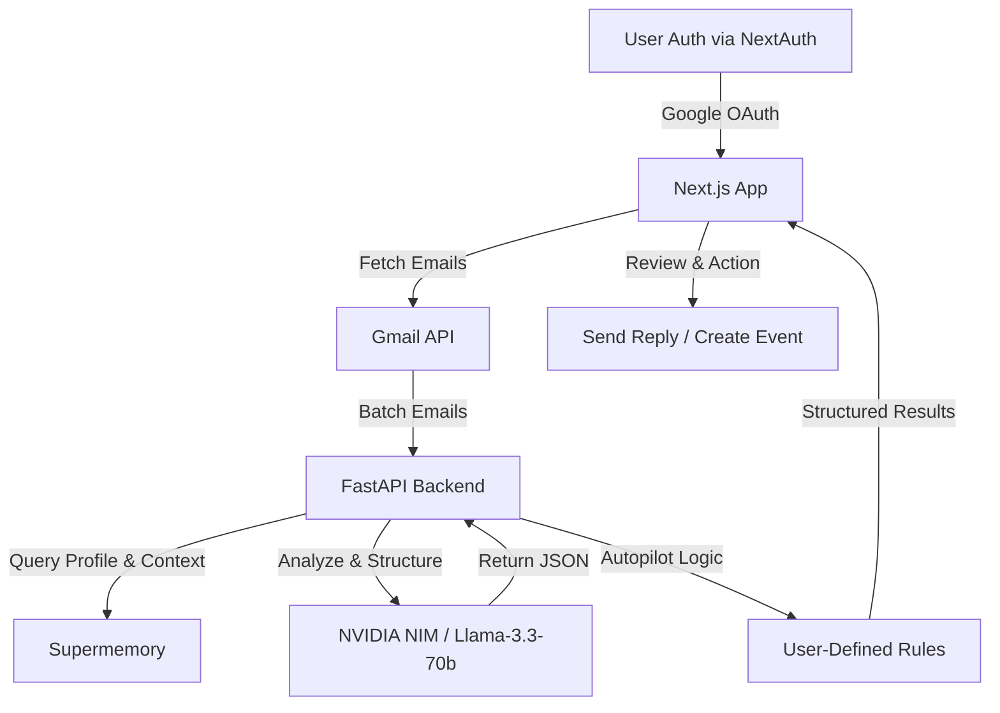

# 🌪️ EmailAssist AI: The Future of Your Inbox

EmailAssist AI is a cutting-edge email management platform that combines modern UI design with state-of-the-art Large Language Models (LLMs) to transform how you handle emails. By leveraging **Llama-3.3-70b** (via NVIDIA NIM) and **Supermemory**, it provides deep context-aware analysis, automated task extraction, and autonomous "Autopilot" capabilities.

---

## ✨ Key Features

- **🧠 Intelligent Summarization**: Get a one-sentence summary of every email, no matter how long the thread.
- **🚥 Priority Detection**: Automatically categorizes emails into `urgent`, `requires_action`, or `fyi` with reasoning.
- **⚡ Autonomous Autopilot**: Define natural language rules (e.g., "Always reply formally to my investors"), and let the AI decide which actions to take.
- **📅 Contextual Extraction**: Detects meeting requests and action items, turning them into calendar events and task lists instantly.
- **🖋️ Tone-Aware Reply Generation**: Compose professional, friendly, formal, or concise replies in seconds, incorporating past interactions from memory.
- **🕰️ Long-Term Memory**: Uses [Supermemory](https://supermemory.ai) to store and retrieve user profiles and relevant past emails for truly personalized assistance.
- **🎨 Premium Bento Dashboard**: A fluid, interactive UI built with **Tailwind CSS v4** and **Framer Motion** for a high-end user experience.
- **🔒 Secure Integration**: Full **Google OAuth** integration via **Next-Auth v5** for safe access to your Gmail and Calendar.

---

## 🛠️ Tech Stack

### Frontend
- **Framework**: Next.js 15 (App Router)
- **Library**: React 19
- **Styling**: Tailwind CSS v4
- **Animations**: Framer Motion
- **Icons**: Lucide-react
- **Auth**: Next-Auth v5 (Beta)

### Backend
- **Framework**: FastAPI (Python 3.12+)
- **LLM Engine**: Groq (Llama-3.3-70b-instruct) via **NVIDIA NIM**
- **Memory Layer**: Supermemory API
- **Model Validation**: Pydantic
- **Package Manager**: `uv` (Modern Python Environment)

### Infrastructure & APIs
- **Database**: MongoDB (via Mongoose)
- **Email/Calendar**: Google Gmail & Calendar APIs
- **Deployment**: Vercel (Frontend), Docker-ready

---

## 🚦 System Architecture & Flow



1.  **Authentication**: User logs in with Google.
2.  **Email Fetching**: The frontend fetches the latest emails from the Gmail API using secure tokens.
3.  **AI Analysis**: Emails are sent to the FastAPI backend, which processes them in batches (3 at a time) using Groq's high-performance LLM endpoint.
4.  **Context Injection**: The AI queries **Supermemory** for the user's "static/dynamic profile" to ensure all responses and summaries are tailored to the user.
5.  **Autonomous Decision**: The "Autopilot" engine checks incoming emails against natural language rules to decide if it should automatically trigger a reply or a calendar event.
6.  **Interactive Dashboard**: Structured data is displayed in a beautiful Bento Grid, allowing the user to approve AI suggestions with a single click.

---

## 🚀 Getting Started

### Prerequisites
- [Node.js](https://nodejs.org/) (v18+)
- [Python 3.12+](https://www.python.org/)
- [`uv`](https://github.com/astral-sh/uv) (Highly recommended for Python management)

### 1. Clone the Project
```bash
git clone https://github.com/your-repo/emailassist-ai.git
cd emailassist-ai
```

### 2. Backend Setup (`Auro University` or `emailassist-ai`)
Navigate to the backend directory:
```bash
cd "Auro University"
```
**Using `uv` (Recommended):**
```bash
# Create and activate venv, install dependencies
uv sync
```
**Configure Environment:**
Create a `.env` file in the backend directory:
```env
NVIDIA_NIM_API_KEY=your_nvidia_api_key
SUPERMEMORY_API_KEY=your_supermemory_api_key
```
**Start the Backend:**
```bash
uv run python main.py
```

### 3. Frontend Setup (`emailassist`)
Navigate to the frontend directory:
```bash
cd ../emailassist
```
**Install Dependencies:**
```bash
npm install
```
**Configure Environment:**
Create a `.env.local` file:
```env
# Google OAuth
GOOGLE_CLIENT_ID=your_google_client_id
GOOGLE_CLIENT_SECRET=your_google_client_secret

# NextAuth
NEXTAUTH_SECRET=your_32_char_secret
NEXTAUTH_URL=http://localhost:3000

# MongoDB
MONGODB_URI=mongodb://127.0.0.1:27017/emailassist

# Backend URL
FASTAPI_URL=http://127.0.0.1:8000
```
**Start the Frontend:**
```bash
npm run dev
```

---

## 📸 Demo & Screenshots

> [!TIP]
> Use the **Bento Grid** to quickly scan through urgent tasks. The emerald accents indicate high-priority items extracted by the AI.

> [!IMPORTANT]
> To use the **Autopilot** feature, ensure your rules are clear. For example: *"If an email is from Sarah about a meeting, auto-accept and add it to my calendar."*

---

## 📄 License
This project is licensed under the MIT License - see the LICENSE file for details.

---

Built with ❤️ by the **Auro-Strawhats** Team.
